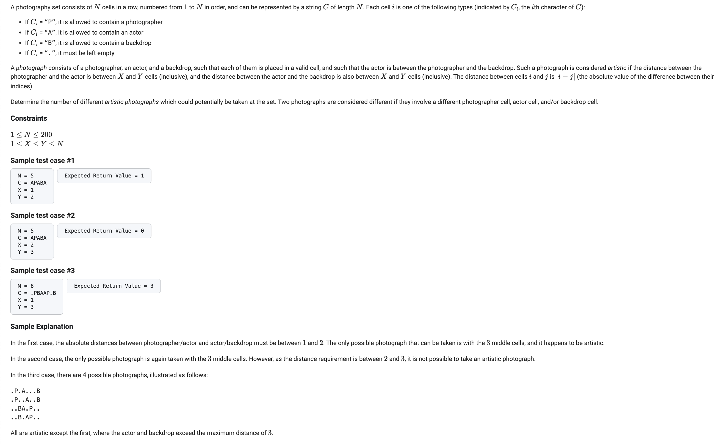
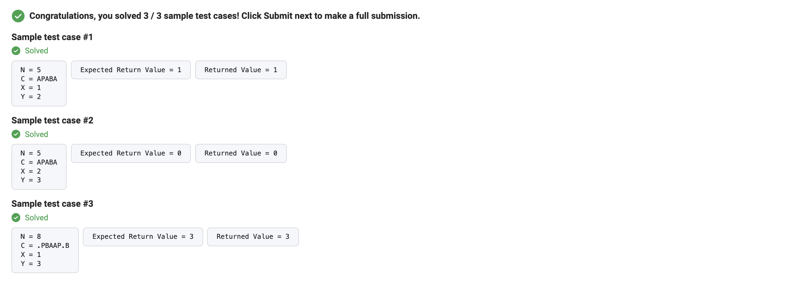

      def getArtisticPhotographCount(N: int, C: str, X: int, Y: int) -> int:
          P = [0] * (N + 1)
          B = [0] * (N + 1)

          # Count cumulative portraits and landscapes
          for i in range(1, N + 1):
            curr = C[i - 1]
            P[i] = P[i - 1] + (1 if curr == 'P' else 0)
            B[i] = B[i - 1] + (1 if curr == 'B' else 0)

          # Count artistic photographs
          ans = 0
          for i in range(N):
            if C[i] == 'A':
              # Calculate valid starting and ending positions for portraits and landscapes
              fstart = min(i + X, N)
              fend = min(i + Y + 1, N)
              bend = max(i - X + 1, 0)
              bstart = max(i - Y, 0)

              # Count artistic photographs based on portrait and landscape combinations
              ans += (P[fend] - P[fstart]) * (B[bend] - B[bstart])
              ans += (B[fend] - B[fstart]) * (P[bend] - P[bstart])

          return ans

