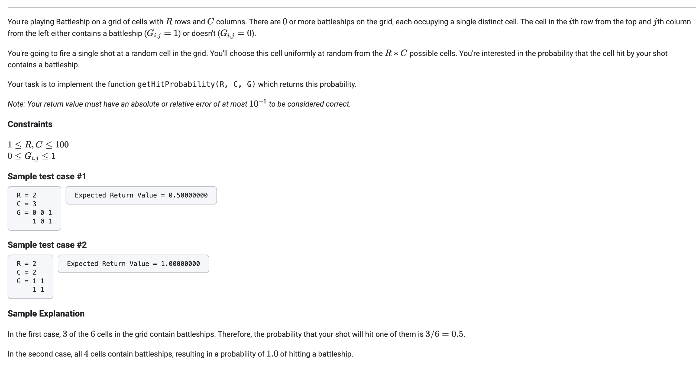
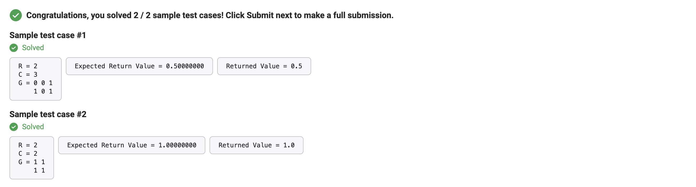

      from typing import List
      # Write any import statements here

      def getHitProbability(R: int, C: int, G: List[List[int]]) -> float:
        battleships = 0
        for i in range(R):
          for j in range(C):
            battleships += G[i][j]
            
        return battleships / (R*C)

